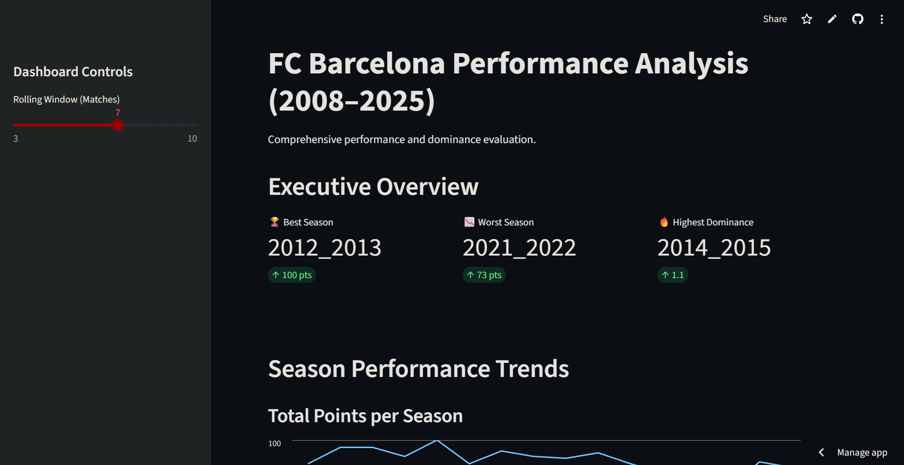
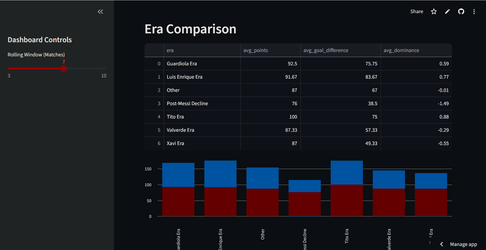

# FC Barcelona Performance Analytics: A Data Science Project

## Overview

This project is an end-to-end data science analysis of FC Barcelona’s competitive performance from 2008 to 2025.

The objective is to design a modular analytical system that processes match-level data, derives structured performance metrics, applies rolling statistical analysis, and visualizes long-term structural trends through an interactive dashboard.

This project demonstrates applied data analysis, feature engineering, time-series reasoning, and scalable software design.

---

## 🌐 Live Dashboard

Interactive Streamlit Deployment:

🔗 [https://fcbarcelona-analytics.streamlit.app](https://fcbarcelona-analytics.streamlit.app/)  

The dashboard allows users to explore season trends, rolling form indicators, and era-based structural comparisons dynamically.

---

## 📸 Dashboard Preview

### Executive Overview


### Era Comparison Analysis


---

## Problem Statement

How has FC Barcelona’s performance evolved over time, and how can short-term form fluctuations and long-term structural trends be quantified using data?

This project addresses:

- Short-term performance volatility using rolling metrics  
- Long-term season trends using aggregated features  
- Era-based structural performance differences  
- Quantitative comparison across competitive phases  

---

## Key Quantitative Findings

The analysis identifies distinct structural phases in performance:

- 🏆 **Peak Season:** 2012–2013 with 100 league points  
- 📉 **Lowest Season:** 2021–2022 with 73 points  
- 🔥 **Highest Dominance Index:** 2014–2015  
- 📊 **Strongest Era by Average Points:** Tito Era  
- ⚠️ **Largest Performance Decline:** Post-Messi period  

These findings demonstrate measurable dominance cycles and post-transition volatility.

---

## Data Pipeline

The project follows a structured data workflow:

1. Raw match data ingestion  
2. Data cleaning and preprocessing  
3. Feature engineering (points, goal difference, rolling averages)  
4. Aggregation to season-level metrics  
5. Analytical modeling and visualization  

The modular design ensures separation between data engineering, analytical computation, and presentation layers.

---

## Key Analytical Components

### 1. Feature Engineering

Derived structured features including:

- Points per match  
- Goal difference  
- Cumulative season statistics  
- Rolling averages (form indicators)  
- Dominance index  

These engineered features enable quantitative comparison across competitive periods.

---

### 2. Rolling Time-Series Analysis

Implemented moving window calculations to model short-term form trends.

Techniques used:

- Rolling mean  
- Window-based aggregation  
- Time-indexed modeling  

This enables detection of:

- Momentum shifts  
- Performance instability periods  
- Structural turning points  

---

### 3. Era-Based Comparative Analysis

Defined temporal segments representing competitive phases and compared:

- Average points  
- Goal differential  
- Dominance metrics  

This enables structural performance comparison beyond isolated season-level evaluation.

---

### 4. Interactive Analytical Dashboard

Developed using Streamlit to:

- Visualize long-term season trends  
- Explore rolling performance dynamics  
- Compare performance metrics across eras  
- Adjust rolling window parameters interactively  

The dashboard separates analytical computation from presentation logic.

---

## Technology Stack

- Python  
- Pandas  
- NumPy  
- Matplotlib  
- Seaborn  
- Streamlit  

---

## Project Structure

```
fc-barcelona-performance-analytics/
│
├── app/                 # Streamlit application layer
│   └── streamlit_app.py
│
├── data/                # Raw and processed datasets (local)
│   ├── raw/
│   └── processed/
│
├── src/
│   ├── data/            # Data ingestion and cleaning
│   ├── analysis/        # Analytical computations
│   └── report/          # Report generation
│
├── reports/             # Dashboard previews
│
├── requirements.txt
└── README.md
```

The architecture emphasizes modularity, maintainability, and scalability.

---

## Skills Demonstrated

- Data preprocessing and cleaning  
- Feature engineering  
- Rolling time-series modeling  
- Statistical aggregation  
- Comparative performance analysis  
- Dashboard development  
- Modular Python project architecture  
- Analytical storytelling through visualization  

---

## How to Run Locally

Clone the repository:

```bash
git clone https://github.com/Vaenvoice/fc-barcelona-performance-analytics.git
cd fc-barcelona-performance-analytics
```

Create a virtual environment:

```bash
python -m venv venv
```

Activate (Windows):

```bash
venv\Scripts\activate
```

Install dependencies:

```bash
pip install -r requirements.txt
```

Run the application:

```bash
streamlit run app/streamlit_app.py
```

---

## Future Improvements

- Elo-based team strength modeling  
- Predictive modeling for match outcomes  
- Expected goals (xG) efficiency comparison  
- Performance volatility index  
- Cross-validation of predictive components  

---

## Author

Vaenvoice  
Undergraduate student focused on data science, statistical modeling, and applied analytics.

